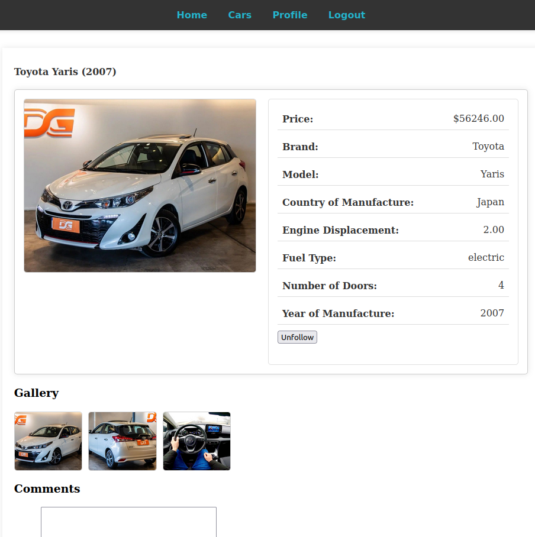
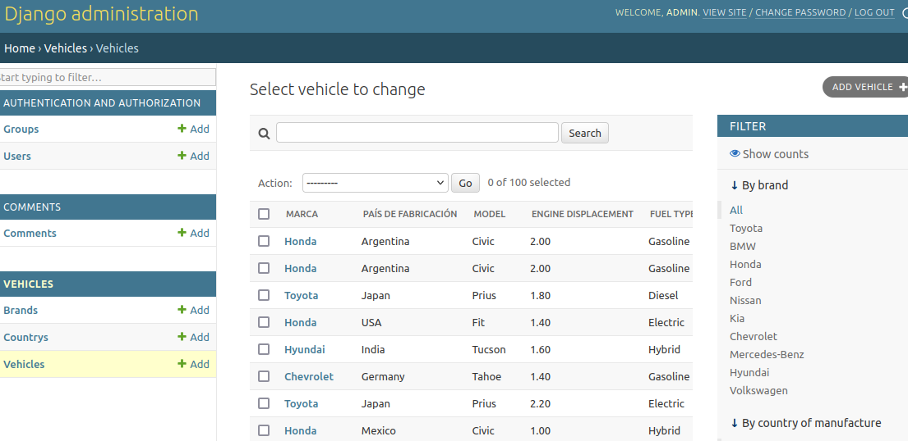

# Concesionario Django Project

Welcome to the **Concesionario Django Project**! This web application, developed as part of the ITEC Río Cuarto program, is designed to manage a car dealership. The project explores the full capabilities of Django using the Model-Template-View (MTV) architecture.

**Please note that this project is currently in development and is not intended for production use.** It serves as a course assignment, with the primary goal of showcasing Django's features in a controlled environment.




## Table of Contents

- [Features](#features)
- [Installation](#installation)
- [Usage](#usage)
- [Credits](#credits)

## Features

- **App Structure**: The project is organized into four main Django apps: `Vehicles`, `Comments`, `Users`, and `Media`, each handling different aspects of the application.
- **No JavaScript**: The project is built purely using Django's Model-Template-View architecture with Python and HTML, without any JavaScript.
- **Image Management**: Images are stored with unique filenames generated using UUIDs to avoid conflicts and ensure consistency.
- **Admin Capabilities**: Admin users have full management capabilities, including uploading and managing images through both the frontend interface and the Django admin backend.
- **User Roles**: The application supports different user roles, each with varying permissions.
- **User Registration and Authentication**: Secure user registration, login, and logout processes.
- **Vehicle Management**: Admins can add, update, and delete vehicles, and upload images.
- **Commenting System**: Users can leave comments on vehicles, with admins and moderators managing these comments.
- **Vehicle Following**: Users can follow specific vehicles and view them in their profiles.
- **Dynamic Filtering**: In the admin panel, vehicles can be filtered by various criteria such as brand, price, and year of manufacture.
- **Context Processors**: Custom context processors dynamically inject user status into templates.


## Installation

### Prerequisites

Before you begin, ensure you have met the following requirements:

- Python 3.10 or higher
- Django 5.1 or higher
- A virtual environment tool like `venv` or `virtualenv`
- Git for version control

### Steps

1. **Clone the Repository**

    ```bash
    git clone https://github.com/Did11/oliva-django-concesionario.git
    cd oliva-django-concesionario
    ```

2. **Set Up the Virtual Environment**

    ```bash
    python3 -m venv entorno
    source entorno/bin/activate  # On Windows use `entorno\Scripts\activate`
    ```

3. **Install Dependencies**

    ```bash
    pip install -r requirements.txt
    ```

4. **Run the Development Server**

    ```bash
    python3 concesionario/manage.py runserver
    ```

The project will be available at `http://127.0.0.1:8000`.

*Note: The project comes with a pre-populated database, including admin users and demo data, so no need to create a new superuser or apply migrations.*


## Usage

- **Admin Panel**: Access the admin panel at `http://127.0.0.1:8000/admin/` using the superuser credentials. From here, you can manage vehicles, images, comments, and user roles with full control.
- **Vehicle Listings**: Explore the comprehensive list of vehicles by visiting the cars section at `http://127.0.0.1:8000/vehicles/`. Users can filter vehicles by various criteria, view detailed information, and interact with features like commenting and following vehicles.
- **User Profile**: After logging in, users can access their profile at `http://127.0.0.1:8000/profile/` to manage their followed vehicles, edit their comments, and update their account details.
**Django Shell**: You can access the Django shell for advanced management and testing by running the following command in your terminal:

    ```bash
    python3 concesionario/manage.py shell
    ```

    From here, you can interact with your Django models and perform database queries directly.

## API Documentation

This project includes a RESTful API that allows external applications to access and manage dealership data, including vehicles, users, comments, and more. The API is documented with Swagger, which provides an interactive UI to explore and test each endpoint.

### Accessing the API

- **API Root**: The API is accessible at `http://127.0.0.1:8000/api/`.
- **Authentication**: Most endpoints require authentication via token. To obtain a token, use the `/token-auth/` endpoint and include it in the headers for authenticated requests.
- **Swagger Documentation**: The full API documentation is available at `http://127.0.0.1:8000/swagger/`. Swagger offers a UI to test each endpoint, view input/output details, and explore parameter options.

### Key API Endpoints

| Endpoint                       | Method | Description                                        |
|--------------------------------|--------|----------------------------------------------------|
| `/api/brands/`                 | GET    | Retrieve a list of all vehicle brands.             |
| `/api/vehicles/`               | GET    | Retrieve a list of vehicles with filtering options.|
| `/api/users/`                  | GET    | Retrieve a list of users (admin access required).  |
| `/api/vehicles/<id>/comments/` | GET    | Retrieve comments for a specific vehicle.          |
| `/api/clients/create/`         | POST   | Create a new client (admin access required).       |
| `/api/clients/`                | GET    | Retrieve a list of clients (admin access required).|
| `/api/token-auth/`             | POST   | Obtain an authentication token for API requests.   |

### Example: Using the API with Postman

1. **Authenticate**: Use the `/api/token-auth/` endpoint to obtain a token. Send a POST request with your username and password in the body.
2. **Set the Token**: Copy the token from the response, then include it in the Authorization header for subsequent requests: `Authorization: Token <your_token>`.
3. **Explore Endpoints**: Use Postman or Swagger to interact with the various endpoints, making sure to include the token for endpoints that require authentication.

### Available API Functionality

The API offers several features for managing dealership data:
- **Vehicle Listings**: Retrieve and filter vehicle listings with details such as brand, model, year, and more.
- **Commenting**: Access comments on specific vehicles and manage comments (with admin privileges).
- **Client Management**: Admin users can create and list clients for the dealership.
- **User Profiles**: Retrieve user profile information (admin access required).

For complete endpoint documentation, including parameters and example responses, refer to the **Swagger documentation** at `http://127.0.0.1:8000/swagger/`.


## Credits

- **Developed by**: Oliva, Didier. 

## License

This project is licensed under the MIT License. See the `LICENSE` file for details.


